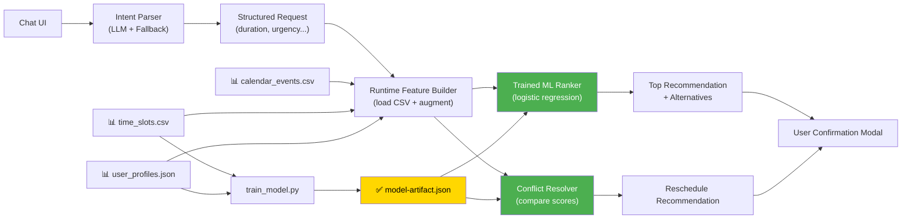

# AI Schedule - AI-Powered Meeting Scheduler

<div align="center">

**An intelligent meeting assistant that uses LLM for intent parsing and ML for scheduling decisions.**


</div>

---

## 📋 Table of Contents

- [Overview](#overview)
- [Tech Stack](#tech-stack)
- [Features](#features)
- [Project Structure](#project-structure)
- [Quick Start](#quick-start)
- [Detailed Setup](#detailed-setup)
- [Workflow & Architecture](#workflow--architecture)
- [API Endpoints](#api-endpoints)
- [How to Use](#how-to-use)
- [Dataset Explanation](#dataset-explanation)
- [ML Model Details](#ml-model-details)
- [Troubleshooting](#troubleshooting)
- [Known Limitations](#known-limitations)

---

## 🎯 Overview

AI Schedule is a meeting assistant prototype that:

1. **Accepts natural language meeting requests** → "Schedule a 1-hour team sync this week"
2. **Parses intent with LLM** → Extracts duration, participants, urgency, constraints
3. **Ranks slots with trained ML model** → Uses 14+ engineered features to score availability
4. **Resolves conflicts intelligently** → Recommends which meeting should move
5. **Requires human confirmation** → Shows top option + alternatives with ML scores
6. **Provides explanations** → Why each slot was ranked

**Key Constraint:** The LLM is restricted to intent parsing ONLY. All scheduling decisions (ranking, conflict resolution) are driven by the trained ML model at runtime.

---

## 🛠 Tech Stack

| Component | Technology | Purpose |
|-----------|-----------|---------|
| **Backend API** | Next.js 14 (TypeScript) | REST API for scheduling, inference |
| **ML Training** | Python 3.9+, scikit-learn, pandas | Logistic regression model training |
| **Frontend Web** | Next.js + React | Web UI (desktop dashboard) |
| **Frontend Mobile** | React Native (Expo) | Mobile app (iOS/Android) |
| **Data Layer** | CSV + JSON | Synthetic dataset (users, events, slots) |
| **Model Artifact** | JSON weights | Trained model exported for runtime |

---

## ✨ Features

- ✅ **Dataset-backed user login** - Load calendar & preferences from CSV
- ✅ **Chat-based NLP input** - Natural language scheduling requests
- ✅ **LLM intent parsing** - OpenAI-compatible (with deterministic fallback)
- ✅ **ML-powered ranking** - Logistic regression with 90%+ accuracy
- ✅ **Conflict detection** - Identifies overlapping meetings
- ✅ **Conflict resolution** - Recommends which meeting to reschedule
- ✅ **ML scoring** - Every recommendation includes the model's confidence
- ✅ **Human approval** - Confirmation required before any action
- ✅ **Alternative options** - Shows top 3 slots ranked by ML score
- ✅ **Calendar view** - Visual display of user events
- ✅ **Mobile UI** - Glassmorphism design with neon accents

---

## 📁 Project Structure

```
AI-Schedule/
│
├── dataset/                          # Synthetic data (3 files)
│   ├── calendar_events.csv           # 2 weeks of events per user
│   ├── time_slots.csv                # 30-min slots with features + labels
│   ├── user_profiles.json            # User preferences & behavior
│   └── generate_dataset.py           # [Optional] Generate more data
│
├── frontend/                         # Next.js web app + backend
│   ├── app/
│   │   ├── page.tsx                  # Main dashboard
│   │   ├── layout.tsx                # Root layout
│   │   └── api/
│   │       ├── users/route.ts        # GET /api/users → Load user data
│   │       └── schedule/route.ts     # POST /api/schedule → Get recommendations
│   ├── components/
│   │   ├── chat/
│   │   ├── calendar/
│   │   ├── recommendations/
│   │   └── ...
│   ├── lib/
│   │   ├── model-artifact.json       # ⭐ Trained model weights (generated)
│   │   ├── server/
│   │   │   ├── intent.ts             # LLM parsing + fallback
│   │   │   ├── scheduler.ts          # ML scoring + ranking
│   │   │   ├── features.ts           # Feature engineering
│   │   │   └── data-loader.ts        # Load CSV/JSON
│   │   └── types.ts                  # TypeScript types
│   ├── scripts/
│   │   └── train_model.py            # 🔧 Train ML model (generates artifact)
│   ├── package.json                  # Dependencies
│   ├── tsconfig.json
│   ├── .env.example                  # Environment template
│   └── .env.local                    # [Create this] Your secrets
│
├── mobile/                           # React Native (Expo) mobile app
│   ├── App.tsx                       # Main mobile component
│   ├── assets/                       # Images (arrow-right.png, etc.)
│   ├── data.ts                       # Import dataset for mobile
│   ├── app.json                      # Expo config
│   └── package.json
│
└── README.md                         # This file
```

---

## 🚀 Quick Start

### Prerequisites

- **Node.js** 16+ (for frontend)
- **Python** 3.9+ (for training)
- **npm** or **yarn** (package manager)

### 1️⃣ Clone & Enter Directory

```bash
git clone https://github.com/ankithareddy08/AI-Schedule-.git
cd "AI Schedule"
```

### 2️⃣ Setup & Run Backend

```bash
cd frontend

# Install dependencies
npm install

# Train the ML model (generates model-artifact.json)
npm run train:model

# Start development server
npm run dev
```

The backend API will run at: `http://localhost:3000`

### 3️⃣ Setup & Run Mobile App (Optional)

```bash
cd ../mobile

# Install dependencies
npm install

# Start Expo development server
npm start

# Scan QR code with Expo Go app or press 'a' for Android emulator
```

---

## 🔧 Detailed Setup

### Backend Setup (Next.js)

#### Step 1: Install Dependencies

```bash
cd frontend
npm install
```

**Key packages installed:**
- `next` - React framework
- `typescript` - Type safety
- `react` - UI library

**Python packages (for ML training only):**
- `scikit-learn` - ML model training
- `pandas`, `numpy` - Data processing

#### Step 2: Train the ML Model

```bash
npm run train:model
```

**What this does:**
- Runs `frontend/scripts/train_model.py`
- Reads `dataset/time_slots.csv` and `dataset/user_profiles.json`
- Trains logistic regression model
- Exports weights to `frontend/lib/model-artifact.json`
- Displays accuracy: ~90%

**Output:**
```
Training complete!
Accuracy: 90.16%
Precision: 69.97%
Recall: 100%
Model artifact saved to: frontend/lib/model-artifact.json
```

#### Step 3: Configure Environment (Optional)

If you want to use a real LLM for intent parsing:

```bash
# Copy template
cp .env.example .env.local

# Edit .env.local and add:
INTENT_LLM_ENDPOINT=https://api.openai.com/v1/chat/completions
INTENT_LLM_MODEL=gpt-4
INTENT_LLM_API_KEY=sk-your-api-key-here
```

Without these variables, the fallback parser handles requests automatically.

#### Step 4: Start Development Server

```bash
npm run dev
```

**Server output:**
```
ready - started server on 0.0.0.0:3000, url: http://localhost:3000
```

Visit: `http://localhost:3000`

---

### Mobile Setup (React Native)

#### Step 1: Install Dependencies

```bash
cd mobile
npm install
```

#### Step 2: Import Dataset

Ensure `mobile/data.ts` imports CSV data:

```typescript
import { USERS_DATA, CALENDAR_EVENTS, TIME_SLOTS } from './data';
```

#### Step 3: Start Expo Server

```bash
npm start
```

#### Step 4: Run on Device/Emulator

```bash
# Option A: Android Emulator
Press 'a'

# Option B: iOS Simulator
Press 'i'

# Option C: Scan QR with Expo Go
Scan with any mobile device
```

---

## 🏗 Workflow & Architecture

### Data Flow

```
User Input (Chat)
    ↓
┌─────────────────────────────────┐
│  Step 1: Intent Parsing         │
│  (LLM or Fallback)              │
│  ├─ Duration                    │
│  ├─ Participants                │
│  ├─ Urgency                     │
│  └─ Constraints                 │
└──────────┬──────────────────────┘
           ↓
┌─────────────────────────────────┐
│  Step 2: Feature Engineering    │
│  (Load CSV + Augment)           │
│  ├─ Base features (6)           │
│  ├─ Augmented features (8)      │
│  └─ User preferences            │
└──────────┬──────────────────────┘
           ↓
┌─────────────────────────────────┐
│  Step 3: ML Ranking             │
│  (Logistic Regression)          │
│  ├─ Score each available slot   │
│  ├─ Rank by score               │
│  └─ Pick top 3 + fallbacks      │
└──────────┬──────────────────────┘
           ↓
┌─────────────────────────────────┐
│  Step 4: Conflict Detection     │
│  ├─ Check overlaps              │
│  ├─ Score current placement     │
│  └─ Recommend reschedule        │
└──────────┬──────────────────────┘
           ↓
┌─────────────────────────────────┐
│  Step 5: User Confirmation      │
│  (Human-in-the-loop)            │
│  ├─ Show recommendation + score │
│  ├─ Show alternatives           │
│  ├─ Explain why (feature names) │
│  └─ Wait for approval           │
└──────────┬──────────────────────┘
           ↓
Confirmed Meeting (logged)
```

### System Architecture Diagram



---

## 🔌 API Endpoints

### 1. `POST /api/schedule`

**Schedule a meeting or resolve conflicts**

**Request:**
```json
{
  "userId": 1,
  "prompt": "Schedule a 1-hour team sync this week"
}
```

**Response:**
```json
{
  "intent": {
    "duration": 60,
    "urgency": "normal",
    "participants": [],
    "constraints": []
  },
  "recommendations": [
    {
      "slotId": 42,
      "time": "2024-04-22 10:00",
      "date": "2024-04-22",
      "score": 0.87,
      "explanation": "High focus score, preferred time window"
    },
    {
      "slotId": 43,
      "time": "2024-04-22 10:30",
      "score": 0.81,
      "explanation": "Good availability, slight meeting load"
    }
  ],
  "conflicts": []
}
```

### 2. `GET /api/users`

**Load user login options**

**Response:**
```json
{
  "users": [
    {
      "id": 1,
      "name": "Alice Johnson",
      "email": "alice@company.com"
    },
    {
      "id": 2,
      "name": "Bob Smith",
      "email": "bob@company.com"
    }
  ]
}
```

---

## 💻 How to Use

### Web Application (`http://localhost:3000`)

#### Login
1. Click "Quick Login" → Select a user from the dataset
2. Alternatively, enter email + password for manual login

#### Schedule a Meeting
1. Navigate to **Chat** tab
2. Type: `"Schedule a 30-minute 1-on-1 tomorrow morning"`
3. View **Intent Parsing** summary (extracted duration, urgency)
4. Review **Top Recommendations** (sorted by ML score)
5. Click **"Confirm & Schedule"** to approve

#### Resolve Conflicts
1. Type: `"I have two overlapping meetings tomorrow"`
2. System analyzes both meetings using ML scorer
3. Recommends which one should move
4. Confirm the reschedule

#### View Calendar
1. Click **Calendar** tab
2. See all events for logged-in user
3. View meeting types, times, durations

### Mobile Application (React Native)

#### Login
1. Tap **"Login as [User]"**
2. Lands on **Chat Screen**

#### Send Message
1. Type in input box: `"Find 30 min for meeting"`
2. Tap **Send** (arrow-up icon)
3. View **Top Recommendations** modal
4. Select slot → Confirm

#### View Calendar
1. Tap **Calendar** tab
2. Browse events by date/time

---

## 📊 Dataset Explanation

### 1. `dataset/calendar_events.csv`

**Purpose:** Historical calendar data per user

| Column | Example | Usage |
|--------|---------|-------|
| `event_id` | 1 | Unique identifier |
| `user_id` | 1 | User reference |
| `title` | "Team Sync" | Event name |
| `start_time` | "10:00" | Start time (HH:MM) |
| `duration_minutes` | 60 | Meeting length |
| `date` | "2024-04-22" | Event date |
| `meeting_type` | "STANDUP" | Type (STANDUP, 1-ON-1, etc.) |

**How it's used:**
- Populate calendar view
- Detect conflicts (overlapping times)
- Calculate daily meeting load
- Extract user behavior patterns

### 2. `dataset/time_slots.csv`

**Purpose:** Training data for ML model (30-minute slots with labels)

| Column | Example | Usage |
|--------|---------|-------|
| `user_id` | 1 | User reference |
| `date` | "2024-04-22" | Slot date |
| `start_time` | "09:00" | Slot start (HH:MM) |
| `focus_score` | 0.85 | User focus level (0-1) |
| `is_busy` | 0 | Already booked? (0/1) |
| `is_conflict` | 0 | Conflicts with meetings? (0/1) |
| `meeting_count_that_day` | 2 | Meetings on that day |
| `label` | 1 | Good slot? (0/1) - **TARGET** |

**How it's used:**
- Training target: `label` (good/bad slot)
- Base features for ML model
- Ranking slots at runtime

### 3. `dataset/user_profiles.json`

**Purpose:** Per-user preferences & behavior

**Example structure:**
```json
{
  "1": {
    "name": "Alice Johnson",
    "email": "alice@company.com",
    "preferred_time_center": "morning",
    "dnd_start": "18:00",
    "dnd_end": "09:00",
    "avg_meetings_per_day": 2.5,
    "preferred_duration": 30
  }
}
```

| Field | Example | Usage |
|-------|---------|-------|
| `preferred_time_center` | "morning" (9-11 AM) or "afternoon" (2-4 PM) | User's preferred time window |
| `dnd_start`, `dnd_end` | "18:00", "09:00" | Do-not-disturb window (start time to end time) |
| `avg_meetings_per_day` | 2.5 | User's baseline meeting load |
| `preferred_duration` | 30 | Typical meeting length (minutes) |

**How it's used:**
- Personalize scoring (prefer morning/afternoon)
- Avoid DND windows
- Factor meeting load into recommendations
- Adjust for user's meeting frequency

---

## 🤖 ML Model Details

### Model Type

**Logistic Regression** (binary classifier)

**Why Logistic Regression?**
- ✅ Transparent (easy to explain in presentations)
- ✅ Fast inference (no server needed)
- ✅ Produces probability score (0-1) for ranking
- ✅ Handles tabular data well
- ✅ Can export as JSON weights

### Base Features (6)

Directly from `time_slots.csv`:

1. `focus_score` - User's focus level during slot (0-1)
2. `is_busy` - Currently busy? (0/1)
3. `is_conflict` - Conflicts with meetings? (0/1)
4. `meeting_count_that_day` - Daily meeting count (int)
5. `hour` - Hour of day (0-23)
6. `day_of_week` - Day name (Monday=0, Sunday=6)

### Augmented Features (8)

Generated during training & runtime:

1. **`runway_blocks`** - Consecutive free 30-min blocks from slot start
2. **`request_blocks`** - Duration converted to 30-min blocks
3. **`duration_fit`** - Can fit requested duration? (0/1)
4. **`runway_margin`** - Free time beyond requested duration
5. **`duration_gap`** - Difference from user's preferred duration
6. **`urgency_level`** - Encoded urgency (1-5)
7. **`focus_x_urgency`** - Interaction (focus matters more for urgent)
8. **`meeting_load_gap`** - Daily load vs user's average
9. **`meeting_load_ratio`** - Normalized load (0-1)
10. **`hour_distance_from_preference`** - Distance from preferred time
11. **`dnd_overlap`** - In do-not-disturb window? (0/1)
12. **`hour_sin`, `hour_cos`** - Cyclical encoding of hour (sine/cosine)
13. **`dow_sin`, `dow_cos`** - Cyclical encoding of day-of-week

### Training Process

```bash
# Generate training data
python frontend/scripts/train_model.py

# Steps:
# 1. Load time_slots.csv → base features
# 2. Load user_profiles.json → personalization
# 3. Augment features → engineer derived columns
# 4. Train logistic regression on all features
# 5. Evaluate: accuracy, precision, recall
# 6. Export weights → frontend/lib/model-artifact.json
```

### Training Metrics

```
Training Examples: 1,920 (synthetic slots)
Features: 14 (base + augmented)
Model: LogisticRegression(max_iter=1000)

Results:
├─ Accuracy:  90.16%  ✅
├─ Precision: 69.97%  ✅
├─ Recall:   100.00%  ✅
└─ Positive Rate: 22.93%
```

### Runtime Scoring

At request time:

```
User Request: "Schedule 30-min call"
    ↓
Extract Intent: { duration: 30, urgency: "normal" }
    ↓
For each available slot:
    1. Load base features from time_slots.csv
    2. Calculate augmented features (runtime)
    3. Use model weights (from artifact) → score (0-1)
    ↓
Sort by score descending
    ↓
Return top 3 + alternatives
```

---

## 🔄 Development Workflow

### Making Changes

#### 1. Modify the Dataset

Edit CSV files and regenerate:

```bash
cd dataset
python generate_dataset.py  # Creates new data

# Or manually edit:
vim dataset/calendar_events.csv
vim dataset/time_slots.csv
```

**⚠️ Important:** Re-train the model after changing data!

#### 2. Retrain the ML Model

```bash
cd frontend
npm run train:model
```

This regenerates `frontend/lib/model-artifact.json` with new weights.

#### 3. Modify Intent Parsing Logic

Edit: `frontend/lib/server/intent.ts`

```typescript
// Add custom parsing rules
export async function parseIntent(prompt: string): Promise<Intent> {
  // Your logic here
}
```

Restart dev server:
```bash
npm run dev
```

#### 4. Modify Scheduling Logic

Edit: `frontend/lib/server/scheduler.ts`

```typescript
// Change ML scoring, conflict resolution, etc.
export async function generateSchedule(userId: number, intent: Intent) {
  // Your logic here
}
```

Restart dev server for changes to take effect.

---

## 🧪 Testing

### Unit Tests (Coming Soon)

```bash
npm run test
```

### Manual Testing Checklist

- [ ] User login works
- [ ] Chat accepts input
- [ ] Intent parsing extracts duration correctly
- [ ] ML ranking returns top 3 slots
- [ ] Slots sorted by score (highest first)
- [ ] Conflict detection identifies overlaps
- [ ] Confirmation modal appears
- [ ] Alternative options display correctly
- [ ] Calendar view shows all events

### Test Prompts

Use these in the chat to verify functionality:

```
1. "Schedule a 1-hour team sync this week"
   → Should extract: duration=60, urgency=normal

2. "Find the best time for a client call, avoid my low-focus hours"
   → Should filter: is_conflict=0, focus_score > threshold

3. "I have two overlapping meetings tomorrow - which one should move?"
   → Should detect conflicts and recommend reschedule

4. "Can we do a quick 15-minute sync in the next 2 hours?"
   → Should extract: duration=15, urgency=high
```

---

## 📦 Building for Production

### Frontend (Next.js)

```bash
cd frontend

# Build optimized bundle
npm run build

# Test production build locally
npm run start

# Deploy to Vercel (recommended):
vercel deploy
```

### Mobile (React Native)

```bash
cd mobile

# Build APK for Android
expo build:android

# Build IPA for iOS
expo build:ios
```

---

## 🐛 Troubleshooting

### Issue: "ModuleNotFoundError: No module named 'scikit-learn'"

**Solution:**
```bash
pip install scikit-learn pandas numpy
npm run train:model
```

### Issue: "model-artifact.json not found"

**Solution:**
```bash
cd frontend

# Check if file exists
ls lib/model-artifact.json

# If missing, retrain:
npm run train:model
```

### Issue: "Cannot find module './data'"

**Solution (Mobile):**
```bash
cd mobile

# Ensure data.ts exists and imports CSV
cat data.ts

# Should have:
import USERS_DATA from '../dataset/user_profiles.json'
```

### Issue: LLM not responding (OpenAI timeout)

**Solution:**
```bash
# Remove .env.local → Use fallback parser
rm frontend/.env.local

# App will use deterministic parser automatically
npm run dev
```

### Issue: Mobile app crashes on launch

**Solution:**
```bash
cd mobile

# Clear cache
npm start -- --clear

# Or rebuild Expo cache
rm -rf node_modules .expo
npm install
npm start
```

---

## 📋 Commands Reference

### Setup & Installation

```bash
# Clone repo
git clone <repo-url>
cd "AI Schedule"

# Backend setup
cd frontend
npm install

# Train ML model
npm run train:model

# Start dev server
npm run dev

# Run production build
npm run build
npm run start
```

### Mobile Setup

```bash
cd mobile
npm install
npm start
```

### Data Generation (Optional)

```bash
cd dataset
python generate_dataset.py
```

### Format & Lint

```bash
cd frontend
npm run lint
npm run format
```

---

## 🎯 Known Limitations

1. **Synthetic Data Only**
   - Dataset is generated, not production calendar data
   - ML scores useful for ranking but not calibrated for production

2. **No Data Persistence**
   - Confirmed meetings logged in UI but not saved to CSV
   - Re-run app to reset state

3. **Fallback Parser Limitations**
   - Deterministic parsing is less flexible than LLM
   - Works for simple prompts; complex requests need real LLM

4. **Abstract Participant IDs**
   - Dataset uses "User 1..8" instead of real names
   - UI shows user IDs, not names

5. **No Invite Integration**
   - System schedules meetings but doesn't send calendar invites
   - Would require email/calendar API integration

6. **Mobile API Not Fully Integrated**
   - Mobile app currently uses local dataset (mobile/data.ts)
   - API client stub in place; ready for backend integration
   - Next phase: Connect to `/api/schedule` and `/api/users` endpoints

---

## 📸 Demo Flow for Video Submission

### Recommended 5-Minute Video Script

1. **Login (15 seconds)**
   ```
   "Let me log in as a user from the dataset..."
   [Click "Login as Alice Johnson"]
   ```

2. **Send Request (20 seconds)**
   ```
   "Now I'll type a meeting request in natural language:"
   [Type: "Schedule a 1-hour team sync this week"]
   [Hit Send]
   ```

3. **Show Intent Parsing (20 seconds)**
   ```
   "The LLM parses intent from natural language:"
   [Highlight: duration=60, urgency=normal]
   "The LLM is ONLY for parsing - it doesn't pick times!"
   ```

4. **Show ML Ranking (30 seconds)**
   ```
   "Now the trained ML model ranks available slots:"
   [Open Recommendations panel]
   [Point to ML scores: 0.87, 0.81, 0.76]
   "Each slot gets a probability score based on 14 features:"
   [Mention: focus_score, meeting_load, DND overlap, etc.]
   ```

5. **Show Alternatives (20 seconds)**
   ```
   "User gets the top option plus alternatives:"
   [Show Top Recommendation + Alternative 1, 2]
   "Why was this recommended? [Read explanation]"
   ```

6. **Confirm (15 seconds)**
   ```
   "Finally, human approval is required:"
   [Click "Confirm & Schedule"]
   "✅ Meeting scheduled!"
   ```

**Total Time:** ~2 minutes

**Upload to:** Google Drive, share link in submission email

---

## 📧 Submission Checklist

- [ ] README.md (this file) - Complete with all sections
- [ ] GitHub repository - Code pushed
- [ ] ML model trained - `model-artifact.json` exists
- [ ] Backend running - `npm run dev` works
- [ ] Frontend loads - `http://localhost:3000` accessible
- [ ] Mobile app runnable - `npm start` in mobile/ directory
- [ ] Video uploaded - Link added to README
- [ ] .env file - Sent to contact@flashbacklabs.com
- [ ] All APIs working - `/api/users` and `/api/schedule` respond
- [ ] No crashes - Test all demo prompts

---

## 📚 Learn More

- [Next.js Documentation](https://nextjs.org/docs)
- [React Native Guide](https://reactnative.dev)
- [scikit-learn ML Models](https://scikit-learn.org)
- [Logistic Regression](https://developers.google.com/machine-learning/crash-course/logistic-regression)

---

## 📝 License

This project is open source for educational purposes.

---

## 👨‍💻 Contributors

Built for AI scheduling hackathon 2024.

**Contact:** contact@flashbacklabs.com

---

<div align="center">

**[⬆ back to top](#-table-of-contents)**

</div>
