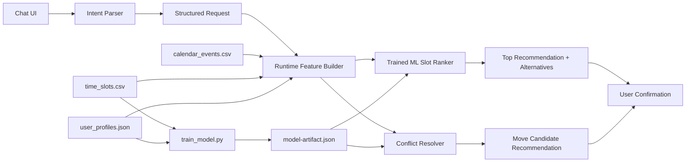

# AI Schedule

AI Schedule is a meeting assistant prototype that keeps the LLM narrowly scoped to intent extraction and pushes every actual scheduling decision through a trained ML model at runtime.

Repository layout:

- `dataset/`: provided synthetic calendar dataset and optional generator
- `frontend/`: Next.js app, API routes, model artifact, training script, and UI

## What the system does

- Accepts meeting requests in natural language
- Uses an LLM-compatible parser only for:
  - duration
  - participants
  - urgency
  - hard constraints
- Uses a trained ML model to rank available time slots live
- Detects overlapping meetings and recommends which one should move
- Returns:
  - proposed slot
  - ML score
  - alternatives
  - explanation
- Requires explicit user confirmation before any scheduling action

## Dataset explanation

- `dataset/calendar_events.csv`
  - Calendar events per user across two weeks
  - Used for calendar rendering, overlap detection, and conflict analysis
- `dataset/time_slots.csv`
  - 30-minute time slots with focus, busy/free, and meeting-load features
  - Includes the `label` column used as the base ML target
- `dataset/user_profiles.json`
  - Per-user preferences such as preferred time, DND windows, average meetings/day, and preferred duration
  - Used in both feature augmentation and runtime personalization

## Feature engineering choices

Base features from `time_slots.csv`:

- `focus_score`
- `is_busy`
- `is_conflict`
- `meeting_count_that_day`
- `hour`
- `day_of_week`

Augmented features added during training and reused at runtime:

- `runway_blocks`
  - Consecutive free 30-minute blocks from a candidate start
- `request_blocks`
  - Duration converted into 30-minute blocks
- `duration_fit`
  - Whether a candidate can fit the requested duration
- `runway_margin`
  - Extra free runway beyond the requested duration
- `duration_gap`
  - Distance from the user's preferred meeting duration
- `urgency_level`
  - Encoded urgency from parsed intent
- `focus_x_urgency`
  - Interaction term so focus matters more for urgent requests
- `meeting_load_gap`
  - Difference between that day's meeting count and the user's average
- `meeting_load_ratio`
  - Normalized daily load
- `hour_distance_from_preference`
  - Distance from the user's preferred time-of-day center
- `dnd_overlap`
  - Whether the slot falls inside the user's DND window
- `hour_sin`, `hour_cos`, `dow_sin`, `dow_cos`
  - Cyclical encodings for time-of-day and day-of-week patterns

## Model selection rationale

The ranking model is a lightweight logistic regression trained in `frontend/scripts/train_model.py`.

Why this model:

- It is transparent and easy to explain in a hackathon setting
- It works well on small structured tabular data
- It produces a score that is easy to use for ranking
- It can be exported as plain weights and reused directly inside the Next.js app without a separate Python inference server

Training details:

- Base target comes from `time_slots.csv -> label`
- Training examples are augmented across multiple durations and urgency levels
- The exported artifact lives at `frontend/lib/model-artifact.json`
- Runtime slot ranking reuses the same learned coefficients

Current local training metrics:

- Accuracy: `90.16%`
- Precision: `69.97%`
- Recall: `100%`
- Positive rate: `22.93%`

## System architecture



## Constraint mapping

1. LLM restricted to intent parsing only

- The parser only extracts request structure.
- It does not rank slots, pick meeting times, or resolve conflicts.
- The app supports any OpenAI-compatible endpoint through:
  - `INTENT_LLM_ENDPOINT`
  - `INTENT_LLM_MODEL`
  - `INTENT_LLM_API_KEY`
- If no endpoint is configured, the app falls back to a deterministic parser for reliability.

2. ML model drives scheduling decisions

- Candidate ranking uses the exported trained model at runtime.
- Conflict resolution compares current placement quality vs best available alternative using the same ML scorer.
- The system does not rely on a pure rule-based scheduler.

3. Human in the loop

- The UI always presents:
  - top recommendation
  - ML score
  - alternatives
- Confirmation is required before any action proceeds.
- The prototype intentionally stops after confirmation instead of mutating the dataset automatically.

4. Reliability

- Missing LLM config falls back safely
- Missing slot history degrades gracefully instead of crashing
- If no fully available slot exists, the system still returns the best fallback candidates
- Conflict analysis returns partial results even when alternatives are sparse

5. UI requirements

- Chat-based input
- Calendar view
- Slot comparison panel with ML scores
- Brief explanation for each recommendation

## Frontend analysis of the Vercel design

The provided Vercel export was visually strong but functionally static:

- chat was simulated
- recommendations were hard-coded
- calendar data was static
- login was decorative

What changed in this implementation:

- kept the visual direction:
  - glassmorphism
  - neon gradients
  - card-based mobile-inspired layout
- replaced mock data with real app behavior:
  - dataset-backed user login
  - live API calls
  - runtime ML scores
  - parsed intent summary
  - conflict comparison
  - confirmation-first scheduling flow

## Project structure

```text
AI Schedule/
- dataset/
  - calendar_events.csv
  - time_slots.csv
  - user_profiles.json
  - generate_dataset.py
- frontend/
  - app/
    - api/users/route.ts
    - api/schedule/route.ts
  - components/aura-sync/
  - lib/server/
  - lib/model-artifact.json
  - scripts/train_model.py
  - .env.example
- README.md
```

## Running locally

From `frontend/`:

```bash
npm install
npm run train:model
npm run dev
```

Optional LLM parsing setup:

1. Copy `frontend/.env.example` to `.env.local`
2. Set:

```bash
INTENT_LLM_ENDPOINT=...
INTENT_LLM_MODEL=...
INTENT_LLM_API_KEY=...
```

Without those variables, the app still works using the built-in fallback parser.

## Demo flow for the hackathon video

Recommended sequence:

1. Select a dataset-backed user
2. Enter one of these prompts:
   - `Schedule a 1-hour team sync this week`
   - `Find the best time for a client call, avoid my low-focus hours`
   - `I have two overlapping meetings tomorrow - which one should move?`
3. Show the parsed intent summary
4. Open the ranked slot comparison panel
5. Highlight the ML score and alternatives
6. Confirm one option to demonstrate the human approval step

Video link placeholder:

- Add the final Drive URL here before submission

## Known limitations

- Participant identities in the synthetic dataset are abstract, so the UI uses `User 1..8`.
- The fallback parser is deterministic and less flexible than a real LLM.
- Confirmed meetings are not persisted back into the CSV dataset.
- The model is trained on synthetic data, so the scores are useful for ranking but not production-calibrated.
- Final browser/build verification still needs to be run after `npm install`, because the current environment did not include installed Node dependencies.
